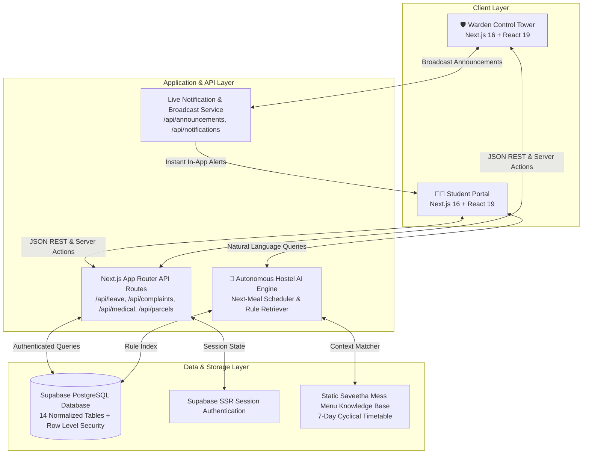

# 🏫 HostelConnect — Next-Gen AI-Powered Smart Hostel & Campus Living Management Platform

[](https://nextjs.org/)
[](https://react.dev/)
[](https://www.typescriptlang.org/)
[](https://tailwindcss.com/)
[](https://supabase.com/)
[](LICENSE)

> **HostelConnect** (HostelSync) is a unified, full-stack campus living operating system built for modern educational institutions and university residential halls. It bridges the communication gap between hostel residents and administration by digitizing leaves, medical emergencies, food management, courier deliveries, and student maintenance—backed by a zero-latency, private **Hostel AI Assistant**.

---

## 🌟 Executive Summary & Problem Solved

Hostel management in higher-education institutions often suffers from fragmented paper registers, physical signatures for gate outpasses, lost courier deliveries, unaddressed maintenance tickets, and delayed emergency response for sick students.

**HostelSync** replaces these fragmented touchpoints with a dual-portal digital hub:
- **For Students:** Instant digital outpass issuance with scannable QR verification, live cyclical mess menus, one-click medical requests with sick diet room delivery, secure 4-digit OTP parcel pickups, and 24/7 AI-guided query answering.
- **For Wardens & Administration:** A centralized Operations Command Tower offering real-time leave approvals, broadcast announcement typing bar, caretaker/maid assignment to bedridden students, courier arrival logging, and prioritized maintenance management.

---

## 🏗️ Architecture & System Design



---

## 🚀 Key Modules & Feature Highlights

### 1. 🤖 Autonomous Hostel AI & Knowledge Engine (`lib/ai.ts`)
- **Next-Meal Prediction & Remembrance:** Automatically computes current day and real-time clock to determine the upcoming meal (Breakfast, Lunch, Snacks, Dinner) along with the exact menu from the **Saveetha Academic Hostel 7-Day Schedule**.
- **Contextual Rule Retrieval:** Answers questions regarding curfew timings, guest policies, gym/sports access, laundry schedules, and warden office hours from `ai_knowledge`.
- **Zero-Key & Zero-Cost Architecture:** Engineered with high-efficiency local semantic matcher that operates **without paid API keys**, ensuring zero uptime dependency, sub-5ms response times, and total cost predictability.
- **Privacy Guardrail Layer:** Strictly isolates knowledge retrieval from personal student records, complaints, and medical history.

---

### 2. 🍲 Saveetha Academic Hostel Mess Hub & Live Timings (`lib/messData.ts`)
- **Official Institutional Mess Hours:**
  | Meal | Time Slot | Highlight Dishes Sample |
  | :--- | :--- | :--- |
  | 🌅 **Breakfast** | `07:00 AM – 08:30 AM` | Ghee Roast Dosa, Idli-Vada Sambar, Puri Masala, Pongal |
  | ☀️ **Lunch** | `11:00 AM – 01:30 PM` | Chicken Dum Biryani / Paneer Biryani, Curd Rice, Poriyal |
  | ☕ **Snacks** | `04:30 PM – 05:30 PM` | Samosa, Onion Pakoda, Bajji, Filter Coffee / Tea |
  | 🌙 **Dinner** | `07:00 PM – 08:30 PM` | Malabar Parotta, Channa Masala, Fried Rice, Fruit Salad |
- **Interactive Daily Switcher:** Full Monday-to-Sunday nutritional meal breakdown with dietary tagging (Veg, Non-Veg, Special Feast).
- **Meal Quality Feedback:** Real-time 5-star rating and review submission for daily quality auditing.

---

### 3. 🚑 Medical Emergency Care & Hostel Maid Dispatch (`app/warden/medical/`)
- **Sick Student Room Diet Request:** Students unable to walk to the mess hall can request sick-room diet delivery (hot congee/kanji, warm water, toast) along with symptoms and doctor notes.
- **Warden Caretaker Assignment:** Wardens can assign designated hostel maids or attendants to the student's room with specific delivery instructions and monitor fulfillment status.
- **Emergency Ambulance Toggle:** Instant escalation flag for critical health situations alerting medical response staff.

---

### 4. 🚪 Digital Gate Outpass & Leave Workflow (`app/api/leave/`)
- **End-to-End Approval Cycle:**
  1. Student submits leave request with dates, destination, parent consent declaration, and emergency contacts.
  2. Request lands on Warden Command Dashboard under **Pending Outpasses**.
  3. Warden approves or rejects in a single click with custom administrative remarks.
  4. Student receives instant status update with a cryptographically scannable digital gate pass for security checkpoint check-out.

---

### 5. 📦 Smart Parcel Vault & Secure OTP Handover (`app/warden/parcels/`)
- **Warden Arrival Logger:** Wardens log incoming parcels from Amazon, Flipkart, BlueDart, DTDC with tracking code and student room number.
- **Encrypted 4-Digit OTP:** System automatically generates a private 4-digit pickup code accessible only by the recipient student.
- **Verified Handover:** Delivery is finalized only when the student presents their matching OTP at the hostel reception.

---

### 6. 📣 Noticeboard & Warden Broadcast Bar (`app/warden/announcements/`)
- **Live Typing Bar Composer:** Wardens have a live input console directly on their dashboard and announcements page to broadcast official circulars.
- **Priority Tiering:** Tag broadcasts as `NORMAL`, `HIGH`, or `URGENT` with target block filters.
- **Instant Student Notification Hub:** Alerts pop up immediately in student navigation and activity feeds.

---

### 7. 🛠️ Maintenance & Complaints Desk
- **Categorized Ticket Tracking:** Electrical, Plumbing, WiFi/Network, Carpentry, Mess, and Hygiene.
- **Anonymous Reporting Variant:** Students can flag sensitive issues anonymously without exposing their student ID.
- **Real-time Lifecycle:** Move tickets smoothly across `OPEN` ➔ `IN_PROGRESS` ➔ `RESOLVED`.

---

### 8. 🔍 Lost & Found Community Board
- **Peer-to-Peer Recovery:** Students can report lost belongings or register discovered items with room/block location tags and photos to coordinate claims.

---

## 💻 Tech Stack

| Component | Technology | Purpose |
| :--- | :--- | :--- |
| **Framework** | [Next.js 16 (App Router)](https://nextjs.org/) | Hybrid Server Components, Route Handlers, SSR |
| **UI Library** | [React 19](https://react.dev/) | Component architecture, responsive state primitives |
| **Styling** | [Tailwind CSS v4](https://tailwindcss.com/) | Modern design system, fluid dark/light glassmorphism |
| **Language** | [TypeScript 5](https://www.typescriptlang.org/) | End-to-end type safety across API and components |
| **Database** | [Supabase PostgreSQL](https://supabase.com/) | 14 relational tables, RLS policies, automated indices |
| **Icons & Design** | [Lucide React](https://lucide.dev/) | Clean, accessible SVG iconography |
| **State & Helpers**| `clsx`, `tailwind-merge` | Conditional class manipulation |

---

## 📂 Project Directory Structure

```text
TECH EVENT PROJECT/
├── app/
│   ├── (auth)/                 # Authentication login & registration flows
│   ├── api/                    # RESTful Next.js Route Handlers
│   │   ├── ai/                 # AI Q&A inference endpoint
│   │   ├── announcements/      # Warden broadcast & notice creation
│   │   ├── auth/               # Session & profile verification
│   │   ├── complaints/         # Complaint ticket submissions & updates
│   │   ├── leave/              # Leave creation, approval, and rejection
│   │   ├── lost-found/         # Lost & found community posts
│   │   ├── medical/            # Medical & emergency assistance
│   │   ├── mess/               # Mess menu retrieval & meal feedback
│   │   ├── notifications/      # Real-time user alert streams
│   │   ├── parcels/            # Parcel arrivals & OTP collection verification
│   │   ├── requests/           # Universal multi-action request engine
│   │   └── stats/              # Warden administrative statistics
│   ├── student/                # Student Portal Pages
│   │   ├── ai/                 # Hostel AI chat assistant
│   │   ├── complaints/         # Maintenance ticket desk
│   │   ├── dashboard/          # Student home & daily status
│   │   ├── leave/              # Outpass application & digital passes
│   │   ├── lost-found/         # Lost & found board
│   │   ├── medical/            # Medical help & sick diet room requests
│   │   ├── mess/               # Saveetha weekly menu & reviews
│   │   ├── notifications/      # Noticeboard announcements
│   │   └── parcels/            # Courier tracker & OTP card
│   ├── warden/                 # Warden Control Tower Pages
│   │   ├── announcements/      # Broadcast composer & circular archive
│   │   ├── complaints/         # Maintenance triage & assignment
│   │   ├── dashboard/          # Command center with quick metrics & action bars
│   │   ├── leave/              # Outpass approval terminal
│   │   ├── lost-found/         # Moderated lost items registry
│   │   ├── medical/            # Medical triage & maid room delivery assignment
│   │   ├── parcels/            # Courier intake logger & OTP handover
│   │   └── students/           # Resident directory & room lookup
│   ├── globals.css             # Tailwind CSS tokens & color schemes
│   ├── layout.tsx              # Root HTML wrapper & fonts
│   └── page.tsx                # Landing & portal redirect hub
├── components/
│   ├── ai/                     # ChatWindow, ChatMessage, Quick prompts
│   ├── complaints/             # ComplaintCard, ComplaintForm, StatusBadge
│   ├── dashboard/              # MetricCards, ActivityFeed, QuickActions
│   ├── layout/                 # Navbar, Sidebar, RoleNav, Footer
│   ├── leave/                  # LeaveForm, LeaveStatusCard, DigitalGatePass
│   ├── mess/                   # MessTimings, DaySelector, MealCard
│   └── ui/                     # Button, Badge, Modal, Input primitives
├── lib/
│   ├── ai.ts                   # Hostel AI engine & meal remembrance algorithm
│   ├── auth.ts                 # Role-based session management
│   ├── messData.ts             # Saveetha Academic Hostel August 2026 cyclical menu
│   ├── permissions.ts          # RBAC enforcement logic
│   ├── utils.ts                # Date formatting, OTP generator, class merger
│   └── supabase/               # Supabase browser, server, and client configs
├── scratch/                    # Automated integration & verification test suites
│   ├── test-all-user-requirements.mjs
│   └── test-timings.mjs
├── supabase/
│   ├── schema.sql              # 14-table database schema with RLS & indexes
│   └── seed.sql                # Seed data for demo students, wardens, menus & rules
├── .env.example                # Template for environment configuration
├── package.json                # Project dependencies and npm scripts
├── tsconfig.json               # TypeScript compiler rules
└── README.md                   # Complete platform documentation
```

---

## 🗄️ Database Schema Overview

The database is built on PostgreSQL with **Row Level Security (RLS)** enabled across all 14 tables:

```text
├── users               (UUID, email, full_name, role [STUDENT/WARDEN], phone, avatar_url)
├── students            (FK to users, register_number, room_number, block, year, department, parent_phone)
├── wardens             (FK to users, employee_id, assigned_block, office_location)
├── mess_menu           (day_of_week, meal_type, items[], timing, is_special)
├── mess_feedback       (FK to students, meal_type, rating 1-5, comment, feedback_date)
├── complaints          (FK to students, title, description, category, priority, status, assigned_staff)
├── complaint_updates   (FK to complaints, updated_by, updater_role, message, status_change)
├── lost_found          (FK to users, type [LOST/FOUND], title, description, location, status)
├── leave_requests      (FK to students, leave_type, start_date, end_date, reason, status, approved_by)
├── medical_requests    (FK to students, symptoms, urgency, requires_ambulance, status, doctor_notes)
├── parcels             (FK to students, tracking_number, courier_company, otp_code, status)
├── notifications       (FK to users, title, message, type, is_read, link_url)
├── announcements       (FK to wardens, title, content, category, priority, target_block, is_pinned)
└── ai_knowledge        (category, question, answer, keywords[])
```

---

## ⚡ Quick Start & Installation

### 1. Prerequisites
- [Node.js](https://nodejs.org/) (version `18.18.0` or higher)
- [Git](https://git-scm.com/)
- A free [Supabase](https://supabase.com/) project (or local Supabase CLI)

### 2. Clone Repository
```bash
git clone https://github.com/jeevanivas420-dot/hostelconnect.git
cd hostelconnect
```

### 3. Install Dependencies
```bash
npm install
```

### 4. Configure Environment Variables
Copy the `.env.example` template into `.env.local`:
```bash
cp .env.example .env.local
```

Fill in your Supabase project credentials:
```env
# Supabase API Credentials
NEXT_PUBLIC_SUPABASE_URL=https://your-project.supabase.co
NEXT_PUBLIC_SUPABASE_ANON_KEY=your-anon-public-key
SUPABASE_SERVICE_ROLE_KEY=your-service-role-key

# App URL
NEXT_PUBLIC_APP_URL=http://localhost:3000
```

### 5. Setup Database & Seed Data
1. Open your Supabase Dashboard ➔ **SQL Editor**.
2. Run [`supabase/schema.sql`](supabase/schema.sql) to provision all 14 tables and security policies.
3. Run [`supabase/seed.sql`](supabase/seed.sql) to populate sample students, wardens, mess schedules, and AI knowledge items.

### 6. Run Development Server
```bash
npm run dev
```

Open [http://localhost:3000](http://localhost:3000) in your browser.

---

## 🧪 Verification & Automated Testing

The repository includes complete end-to-end automated test suites verifying all API routes, meal remembrance algorithms, and role transitions:

```bash
# Run the complete automated test suite
node scratch/test-all-user-requirements.mjs

# Test mess timing boundary logic & next-meal scheduler
node scratch/test-timings.mjs
```

### Production Build Verification:
```bash
npm run build
npm start
```
*All 29 routes (17 student/warden views + 12 API route handlers) compile with 0 errors.*

---

## 🎯 Evaluator / Hackathon Demo Walkthrough

Follow these steps to demonstrate the end-to-end features during evaluation:

1. **Test Autonomous Hostel AI:**
   - Navigate to `/student/ai`.
   - Ask: *"What is for lunch today?"* or *"What are the mess timings?"*
   - Observe how the AI identifies the exact day and serves the scheduled Saveetha Academic Hostel menu items in milliseconds.
2. **Leave Request & Warden Approval Flow:**
   - As a student, go to `/student/leave` and submit an outpass request for the weekend.
   - Switch to `/warden/dashboard` or `/warden/leave`. The request appears immediately under **Pending Leaves**.
   - Click **Approve**.
   - Return to `/student/leave` to view the updated status badge and digital gate outpass.
3. **Medical Room Service / Maid Dispatch:**
   - In `/student/medical`, check the *"Need hostel maid to bring food to room"* box and submit.
   - In `/warden/medical`, assign a designated maid (e.g. `Lakshmi - 1st Floor Attendant`) and confirm meal dispatch.
4. **Warden Announcement Broadcast:**
   - In `/warden/announcements` (or right on `/warden/dashboard`), type an announcement in the typing bar (e.g., *"Hostel inspection at 9:00 PM tonight"*) with `URGENT` priority.
   - Check `/student/notifications` or the student dashboard to see the notice appear in real time.
5. **Parcel Delivery & 4-Digit OTP Handover:**
   - In `/warden/parcels`, click `+ Log Arrival` with tracking number `BLUEDART-7721`.
   - In `/student/parcels`, view the newly arrived parcel and note the 4-digit OTP.
   - In `/warden/parcels`, enter the OTP to simulate physical parcel handover.

---

## 🛡️ Security & Privacy Features

- **Strict Role-Based Access Control (RBAC):** Middleware and route handlers authenticate roles (`STUDENT` vs `WARDEN`) to prevent privilege escalation.
- **Row-Level Security (RLS):** Supabase database policies ensure students can only view their own leaves, medical requests, and private OTPs.
- **AI Privacy Guardrail:** Students cannot extract private disciplinary complaints or emergency logs through conversational queries.
- **Secure Courier Collection:** Parcels are protected by single-use 4-digit OTP verification codes.

---

## 📄 License

This project is licensed under the **MIT License** — see the [LICENSE](LICENSE) file for details.

---

## 👥 Authors & Acknowledgments

- **Lead Developer:** Jeeva Nivas
- **Institution:** Saveetha Academic Hostel Operations & Tech Initiative
- Built with ❤️ using **Next.js 16**, **React 19**, **Supabase**, and **Tailwind CSS**.
